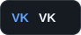

# Andrey Lutcenko

### Frontend Developer · TypeScript / Vue / React

I build B2B systems and customer-facing web apps, with **3+ years of commercial experience**. My focus is scalable interfaces, rendering performance, and thoughtful collaboration with UI/UX teams.

  
  
  
  
  

---

## What I work on

- **Frontend architecture** — scalable interfaces, SSR, microfrontends, and custom component libraries.
- **Performance & experience** — rendering optimization and close collaboration with UI/UX teams.
- **Developer experience** — process automation, tooling, and better team workflows.

## Tech stack

  
  
  
  
  
  

| Area | Technologies |
| :--- | :--- |
| Frontend | JavaScript, TypeScript, Vue 2/3, React, Redux, HTML, CSS, Sass |
| Architecture & UI | SSR, microfrontends, Vue Flow, XState, Vuetify, Ant Design, custom component libraries |
| Backend & real-time | Node.js, Express.js, OAuth 2.0, SignalR, WebSockets |
| Data | PostgreSQL, SQL, Sequelize, IndexedDB |
| Build & delivery | Vite, Webpack, Gulp, Docker, Git, Linux, CI/CD |
| Testing | Jest — unit & integration tests |

## Beyond code

I'm interested in 3D graphics, mountaineering, and travel. I enjoy finding ways to automate repetitive work and make everyday development smoother.

---

**Let's connect:** [Telegram](https://t.me/andLucenko) · [Email](mailto:andreylutcenko123@gmail.com) · [Resume (PDF)](./assets/CV_Frontend_Dev_Andrey_Lucenko.pdf)
